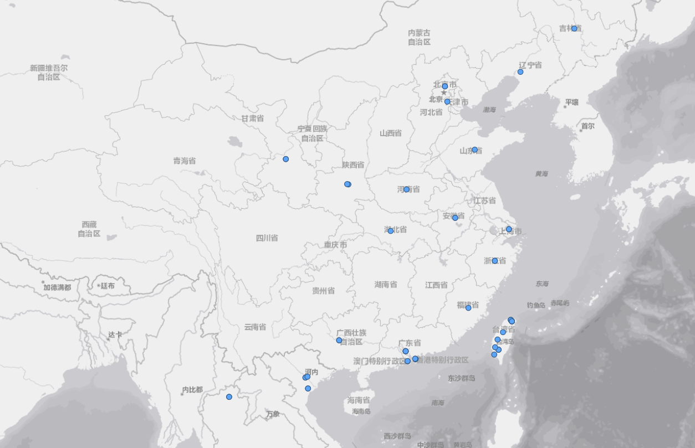
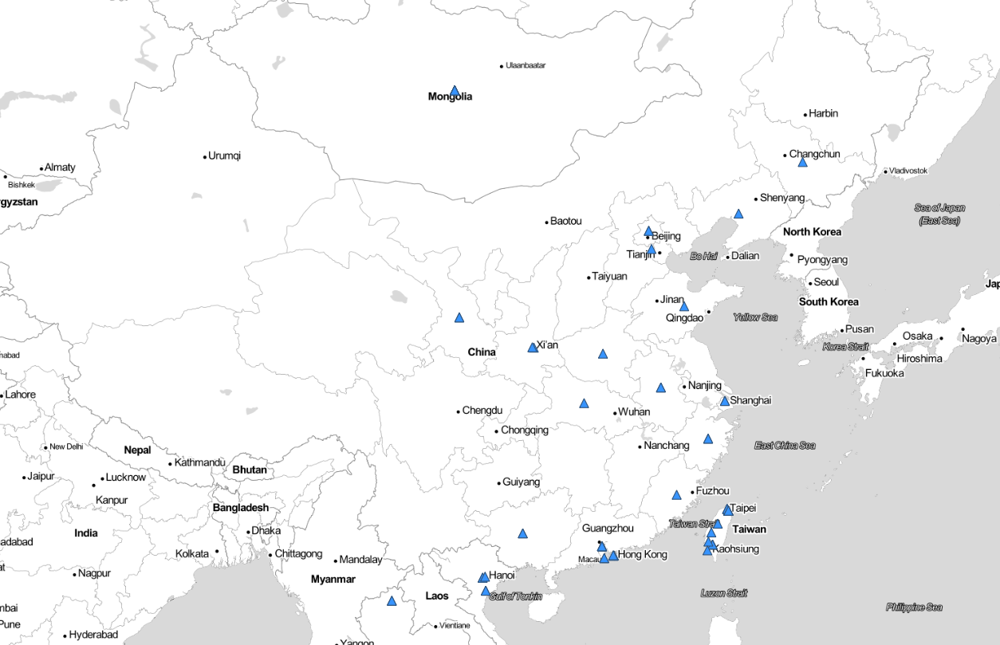
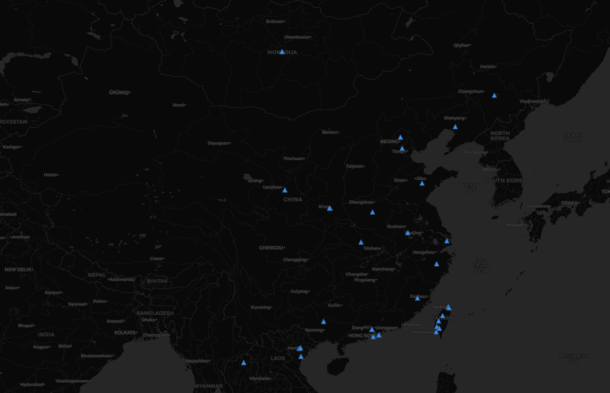

# Tweets-Crawler-Map
<u>A practice learning how to crawl geo-tagged tweets and make a map using the data.</u>

### Where are Twitter users located in mainland China?
The regions in which tweets were crawled for this practice were the center and west parts of China, as this location tends to have more people using Twitter. The purpose of this application was to find out with the despite the internet firewall in mainland China, where are Twitter users located? As we can see in the map, first, the number of people using Twitter was quite small, considering the crawler has been run for five minutes collecting tweets. Second, looking at the geographic locations of the dots within mainland China, people who use Twitter were mainly located in the capital city of each province. It makes sense because those regions are more economically developed where there are more people who seek information outside of the firewall.

### Maps

